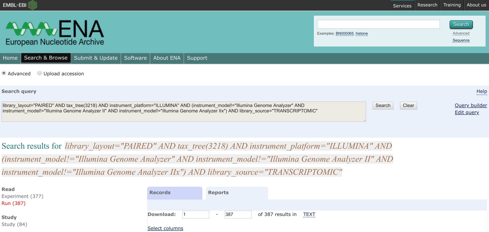

# searchENA2fastq
Small [snakemake](https://snakemake.readthedocs.io/en/stable/) workflow to search the [European Nucleotide Archive](http://www.ebi.ac.uk/ena) and download the corresponding [FASTQ](https://en.wikipedia.org/wiki/FASTQ_format) files.
## Installation
The easiest way to go is install Anaconda or Miniconda and create an environment as follows:
```bash 
conda env create -n YOURWORKFLOW 

conda install -c bioconda snakemake #or snakemake-minimal if you do not want to use remote providers in other workflows see https://bitbucket.org/snakemake/snakemake/issues/991/python-37-compatibility for details

conda install -c anaconda pandas

#unless its installed on your machine:
conda install -c anaconda wget 
```

## Usage


This is still a bit of a hack - in order to use this workflow, (as of 01/20/2019) you have to: 
1. Go to the [ENA Advanced Search](https://www.ebi.ac.uk/ena/data/warehouse/search)
2. Select the domain `Read`
3. Provide your search criteria using the query builder or modify it manually using the `edit search` option
	* the provided examples collects all transcriptomic paired-end Illumina data that have been generated by machines younger than GA IIx: 
```
library_layout="PAIRED" AND tax_tree(3218) AND instrument_platform="ILLUMINA" AND (instrument_model!="Illumina Genome Analyzer" AND instrument_model!="Illumina Genome Analyzer II" AND instrument_model!="Illumina Genome Analyzer IIx")
```
4. Execute the search and refine if necessary - otherwise
5. In the search result select `Run` to view the raw read runs matched by your query
6. Click on the report tab 
7. Modify the column selection to your liking, but in any case include the `run_accession` 
8. Click on the `TEXT` link near the number of results and cancel the download. After that the link will carry the URL you'll need to download
9. Copy it to a file [ena.urls.txt](ena.urls.txt)
```
https://www.ebi.ac.uk/ena/data/warehouse/search?
query=%22library_layout=%22PAIRED%22%20AND%20instrument_platform=%22ILLUMINA%22%20AND%20library_source=%22TRANSCRIPTOMIC%22%20AND%20tax_tree(3218)%20AND%20(instrument_model!
=%22Illumina%20Genome%20Analyzer%22%20AND%20instrument_model!=%22Illumina%20Genome%20Analyzer%20II%22%20AND%20instrument_model!
=%22Illumina%20Genome%20Analyzer%20IIx%22)%22&display=report&result=read_run&fields=study_accession,secondary_study_accession,sample_accession,secondary_sample_accession,
experiment_accession,run_accession,submission_accession,tax_id,scientific_name,instrument_platform,instrument_model,library_name,nominal_length,library_layout,library_strategy,
library_source,library_selection,read_count,base_count,center_name,first_public,last_updated,experiment_title,study_title,study_alias,experiment_alias,run_alias,fastq_bytes,
fastq_md5,fastq_ftp,fastq_aspera,fastq_galaxy,submitted_bytes,submitted_md5,submitted_ftp,submitted_aspera,submitted_galaxy,submitted_format,sra_bytes,sra_md5,sra_ftp,sra_aspera,
sra_galaxy,cram_index_ftp,cram_index_aspera,cram_index_galaxy,sample_alias,broker_name,sample_title,nominal_sdev,first_created&download=txt
```
10. Optionally repeat this for `Study` and `Experiment`
11. Optionally modify the [Snakefile](Snakefile): 
	* `query_result_file`: name of the output tsv file that will harbour the downloaded metadata
	* `ENA_urls`: name of the input file where you copied the URLs from step 9
	* `fastq_path`: path to write the FASTQ files to
12. Execute workflow using [snakemake](https://snakemake.readthedocs.io/en/stable/):
```bash
snakemake
#or executing it on a cluster queue e.g. on SGE
snakemake --cluster 'qsub -q QUEUENAME' -j 50
```
